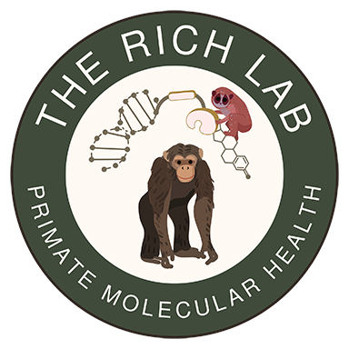

```{r setup, include=FALSE}
knitr::opts_chunk$set(
  echo    = FALSE,
  warning = FALSE,
  message = FALSE,
  comment = ""
  )
library(tidyverse)
library(bslib)
library(htmltools)
```



Welcome to the Rich Molecular Health Lab at the University of Nebraska Omaha! We integrate molecular ecology and physiology, bioinformatics, wildlife conservation, biomedical sciences, and population biology. This comprehensive, interdisciplinary approach allows us to enhance the health, welfare, and conservation of primates and other mammals. Our evidence-based strategies directly inform animal care practices and global conservation efforts.

---

## Research Focus

### Molecular Health and Conservation Genomics {.unlisted}

Our lab applies advanced genomic techniques to study mammalian health, welfare, and conservation:

- **Gut Microbiome and Chronic Disease Risk:** Investigating relationships between diet, microbiome composition, inflammation, and chronic disease in captive and wild primates (*e.g., Figure 1*).
- **Bioactive Foods and Receptor Physiology:** Examining plant compounds in diets and their impacts on primate reproduction and endocrine health (*e.g., Figure 2*).
- **Molecular Tools for Population Management:** Using portable sequencing technologies to perform rapid, low-cost, mitochondrial genome sequencing for improved species management and taxonomic revision (*Figure 3*).
- **Environmental DNA (eDNA) Monitoring:** Developing streamlined methods for non-invasive genetic monitoring of urban and wild North American mammalian populations (*e.g., Figure 3*).
- ***Heavy Metal Toxicity and Microbiome Buffering:*** Studying how heavy metals impact health and how gut microbiomes may mitigate toxic effects in zoo animals.

### Graphical Summaries/Examples

```{r, results='asis'}
withTags(
  page_fluid(
    accordion(
      open     = FALSE,
      multiple = FALSE,
      accordion_panel(
        "Figure 1. Isoflavone metabolism.",
        card(
          card_image(
            file = "graphics/isoflavone_metabolism.png"
          ),
          card_footer(
            "Microbes and metabolic pathways mediate nutritional influences on endocrine function, inflammation, and chronic disease risk",
            small(i("(produced with Biorender)."))
          )
        )
      ),
      accordion_panel(
        "Figure 2. Estrogenic foods.",
        card(
          card_image(
            file = "graphics/phytoestrogen_examples.png"
          ),
          card_footer(
            "Examples of common human foods containing plant compounds capable of impacting endocrine function and gene expression.",
            small(i("(produced with Biorender)."))
          )
        )
      ),
      accordion_panel(
        "Figure 3. PCR-free eDNA Sequencing.",
        card(
          card_image(
            file = "graphics/mtDNA_adaptivesampling.png"
          ),
          card_footer(
            "Implementing Oxford Nanopore Technologies' Adaptive Sampling for a rapid, PCR-free approach to mtDNA sequencing and metabarcoding.",
            small(i("(produced with Biorender)."))
          )
        )
      )
    )
  )
)
```


---


## Join Us!

Are you interested in joining or collaborating with our lab? We encourage you to explore our current projects and opportunities. You can reach out to the PI, Dr. Alicia Rich, via email to discuss potential collaborations. See the [profile of current lab members](about.html) if you are interested in pursuing graduate or undergraduate research in the lab.
